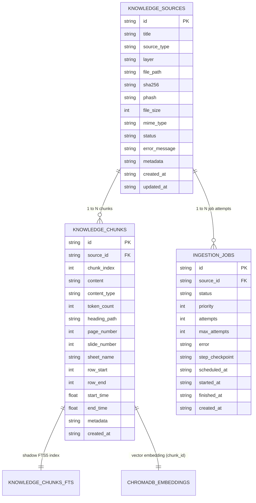

# Data Model: Knowledge Ingestion & Storage Architecture

## 1. Overview
The Personal AI Brain Knowledge Subsystem is designed around a strictly layered, content-addressable, multimodal data model. It maintains full traceability from fine-grained vector embeddings back through extracted chunks and derived artifacts to the original byte stream.



---

## 2. Relational Storage Schema (SQLite: `data/brain.db`)

### 2.1 Table: `knowledge_sources`
Primary registry for all ingested source files, documents, media assets, and external feeds.

```sql
CREATE TABLE IF NOT EXISTS knowledge_sources (
    id TEXT PRIMARY KEY,                       -- UUID v4 format
    title TEXT NOT NULL,                      -- Human-readable name or sanitized original filename
    source_type TEXT NOT NULL,                -- pdf, docx, pptx, xlsx, html, md, image, audio, video
    layer TEXT DEFAULT 'knowledge',           -- foundational, technical, business, creative, personal, ephemeral
    file_path TEXT,                           -- Path relative to data/storage/originals/
    sha256 TEXT UNIQUE,                       -- Content-addressable cryptographic hash (exact dedup)
    phash TEXT,                               -- Perceptual average hash (visual near-duplicate detection)
    file_size INTEGER,                        -- Original payload size in bytes
    mime_type TEXT,                           -- Detected MIME type (e.g. application/pdf, video/mp4)
    status TEXT DEFAULT 'pending',            -- IngestionStatus enum
    error_message TEXT,                       -- Detailed error trace if failed
    metadata TEXT DEFAULT '{}',               -- JSON dictionary of source-level metadata (author, tags, exif, video props)
    created_at TIMESTAMP DEFAULT CURRENT_TIMESTAMP,
    updated_at TIMESTAMP DEFAULT CURRENT_TIMESTAMP
);

CREATE INDEX IF NOT EXISTS idx_ks_sha256 ON knowledge_sources(sha256);
CREATE INDEX IF NOT EXISTS idx_ks_status ON knowledge_sources(status);
CREATE INDEX IF NOT EXISTS idx_ks_layer ON knowledge_sources(layer);
```

### 2.2 Table: `knowledge_chunks`
Atomic text and metadata segments created by format-aware structure chunkers.

```sql
CREATE TABLE IF NOT EXISTS knowledge_chunks (
    id TEXT PRIMARY KEY,                       -- Format: {source_id}_c{chunk_index}
    source_id TEXT NOT NULL,                  -- Foreign key referencing knowledge_sources(id)
    chunk_index INTEGER NOT NULL,             -- 0-indexed sequential chunk position within source
    content TEXT NOT NULL,                    -- Cleaned text content used for embeddings and LLM context
    content_type TEXT DEFAULT 'text',         -- text, table, code, slide, speaker_notes, transcript, scene_description, ocr
    token_count INTEGER,                      -- Approximate or tokenizer-calculated token count
    heading_path TEXT,                        -- Hierarchical heading trail, e.g. "Глава 1 > Раздел 2 > Тарифы"
    page_number INTEGER,                      -- PDF page (1-indexed)
    slide_number INTEGER,                     -- PPTX slide index (1-indexed)
    sheet_name TEXT,                          -- Excel sheet name
    row_start INTEGER,                        -- Excel start row
    row_end INTEGER,                          -- Excel end row
    start_time REAL,                          -- Media timestamp in seconds (start)
    end_time REAL,                            -- Media timestamp in seconds (end)
    metadata TEXT DEFAULT '{}',               -- JSON dictionary of chunk-level metadata
    created_at TIMESTAMP DEFAULT CURRENT_TIMESTAMP,
    FOREIGN KEY (source_id) REFERENCES knowledge_sources(id) ON DELETE CASCADE
);

CREATE INDEX IF NOT EXISTS idx_kc_source ON knowledge_chunks(source_id);
CREATE INDEX IF NOT EXISTS idx_kc_content_type ON knowledge_chunks(content_type);
```

### 2.3 Virtual Table: `knowledge_chunks_fts` (SQLite FTS5)
Full-text search virtual table providing high-performance BM25 lexical retrieval and Russian morphological stemming.

```sql
CREATE VIRTUAL TABLE IF NOT EXISTS knowledge_chunks_fts USING fts5(
    chunk_id UNINDEXED,                       -- References knowledge_chunks.id
    source_id UNINDEXED,                      -- References knowledge_sources.id
    content,                                  -- Searchable text content
    heading_path,                             -- Searchable structural context
    tokenize = 'porter unicode61'             -- Unicode tokenizer with Porter stemmer
);
```

### 2.4 Table: `ingestion_jobs`
Fault-tolerant persistent work queue powering asynchronous background processing and resumption.

```sql
CREATE TABLE IF NOT EXISTS ingestion_jobs (
    id TEXT PRIMARY KEY,                       -- UUID v4
    source_id TEXT NOT NULL,                  -- Target knowledge_sources(id)
    status TEXT DEFAULT 'pending',            -- pending, running, completed, failed, retry_waiting
    priority INTEGER DEFAULT 0,               -- Higher integer indicates higher scheduling priority
    attempts INTEGER DEFAULT 0,               -- Execution count
    max_attempts INTEGER DEFAULT 3,           -- Maximum retry budget
    error TEXT,                               -- Last failure message
    step_checkpoint TEXT,                     -- Current pipeline stage (e.g. "extracting", "chunking", "embedding")
    scheduled_at TIMESTAMP DEFAULT CURRENT_TIMESTAMP,
    started_at TIMESTAMP,
    finished_at TIMESTAMP,
    created_at TIMESTAMP DEFAULT CURRENT_TIMESTAMP,
    FOREIGN KEY (source_id) REFERENCES knowledge_sources(id) ON DELETE CASCADE
);

CREATE INDEX IF NOT EXISTS idx_ij_status_prio ON ingestion_jobs(status, priority DESC, scheduled_at ASC);
```

---

## 3. Vector Storage Schema (ChromaDB: `data/vector_db/`)

The vector layer uses persistent ChromaDB (`PersistentClient`) with a dedicated collection: `brain_knowledge_vectors`.

### 3.1 Collection Configuration
- **Collection Name**: `brain_knowledge_vectors`
- **Embedding Dimensions**: 384 (via `all-MiniLM-L6-v2` ONNX) or 768 (via `text-embedding-004`)
- **Distance Metric**: Cosine distance ($d_{cos} = 1 - \frac{u \cdot v}{\|u\|_2 \|v\|_2}$)
- **Similarity Conversion**: $S_{vec} = 1.0 - \frac{d_{cos}}{2.0} \in [0, 1]$

### 3.2 Document Record Structure
| Attribute | Type | Description | Example |
| :--- | :--- | :--- | :--- |
| `id` | `str` | Matches `knowledge_chunks.id` | `"a1b2c3d4_c0"` |
| `document` | `str` | Normalized chunk text content | `"Пакет 'Премиум': 10 часов съемки, 80 000 руб."` |
| `embedding` | `List[float]` | Dense float vector | `[0.0142, -0.0531, ...]` (length 384) |
| `metadata` | `Dict[str, Any]` | Flat key-value pairs for Chroma filtering | See below |

### 3.3 Chroma Metadata Schema
Chroma requires primitive scalar values in metadata dicts (no nested objects):
```json
{
  "source_id": "a1b2c3d4-e5f6-7a8b-9c0d-1e2f3a4b5c6d",
  "chunk_index": 0,
  "layer": "business",
  "source_type": "xlsx",
  "content_type": "table",
  "heading_path": "Лист 1 > Тарифы",
  "page_number": 0,
  "slide_number": 0,
  "start_time": 0.0,
  "end_time": 0.0
}
```

---

## 4. Physical Storage Layout

All assets reside under `data/storage/` in a strictly non-executable, content-addressable layout:

```
data/storage/
├── originals/                                  # Immutable original binaries
│   ├── <sha256_hash>.pdf
│   ├── <sha256_hash>.docx
│   ├── <sha256_hash>.pptx
│   ├── <sha256_hash>.xlsx
│   ├── <sha256_hash>.jpg
│   ├── <sha256_hash>.wav
│   └── <sha256_hash>.mp4
└── derived/                                    # Extracted and generated sidecars
    └── <source_id>/
        ├── raw_text.txt                        # Clean extracted text dump
        ├── structure.json                      # Structural AST of extracted elements
        ├── audio_track.wav                     # Extracted 16kHz mono audio from video
        ├── transcript.json                     # Faster-Whisper word/segment timed transcript
        ├── manifest.json                       # Audio/Video extraction metadata
        └── keyframes/                          # Visual keyframes sampled at scene cuts
            ├── kf_0001_t001.20s.jpg
            ├── kf_0002_t004.50s.jpg
            └── keyframe_manifest.json
```

---

## 5. Pydantic Domain Models (`src/brain/models/`)

### 5.1 `KnowledgeSource`
```python
class KnowledgeSource(BaseModel):
    id: str = Field(default_factory=lambda: str(uuid.uuid4()))
    title: str
    source_type: str
    layer: KnowledgeLayer = KnowledgeLayer.KNOWLEDGE
    file_path: Optional[str] = None
    sha256: Optional[str] = None
    phash: Optional[str] = None
    file_size: Optional[int] = None
    mime_type: Optional[str] = None
    status: IngestionStatus = IngestionStatus.PENDING
    error_message: Optional[str] = None
    metadata: Dict[str, Any] = Field(default_factory=dict)
    created_at: Optional[str] = None
    updated_at: Optional[str] = None
```

### 5.2 `KnowledgeChunk`
```python
class KnowledgeChunk(BaseModel):
    id: str
    source_id: str
    chunk_index: int
    content: str
    content_type: ContentType = ContentType.TEXT
    token_count: Optional[int] = None
    heading_path: Optional[str] = None
    page_number: Optional[int] = None
    slide_number: Optional[int] = None
    sheet_name: Optional[str] = None
    row_start: Optional[int] = None
    row_end: Optional[int] = None
    start_time: Optional[float] = None
    end_time: Optional[float] = None
    metadata: Dict[str, Any] = Field(default_factory=dict)
    created_at: Optional[str] = None
```

### 5.3 `SourceTrace`
```python
class SourceTrace(BaseModel):
    source_id: str
    chunk_id: str
    title: str
    source_type: str
    score: float
    heading_path: Optional[str] = None
    page_number: Optional[int] = None
    slide_number: Optional[int] = None
    timestamp_range: Optional[Tuple[float, float]] = None
    snippet: str
    content_type: str = "text"
```

### 5.4 `ExtractionResult` & `ExtractedElement`
```python
class ExtractedElement(BaseModel):
    element_type: ContentType = ContentType.TEXT
    content: str
    page_number: Optional[int] = None
    slide_number: Optional[int] = None
    heading_path: Optional[str] = None
    start_time: Optional[float] = None
    end_time: Optional[float] = None
    metadata: Dict[str, Any] = Field(default_factory=dict)

class ExtractionResult(BaseModel):
    elements: List[ExtractedElement] = Field(default_factory=list)
    detected_mime_type: Optional[str] = None
    source_metadata: Dict[str, Any] = Field(default_factory=dict)
    derived_artifacts: Dict[str, str] = Field(default_factory=dict)
```

---

## 6. Ingestion State Machine Transitions

The ingestion lifecycle is managed by `IngestionStateMachine` using 14 valid deterministic transitions:

| From State | To State | Trigger Event | Action |
| :--- | :--- | :--- | :--- |
| `PENDING` | `VALIDATING` | `start_validation` | Check file size, extension, compute SHA-256 |
| `VALIDATING` | `VALIDATED` | `validation_success` | Checksum unique, file format valid |
| `VALIDATING` | `FAILED` | `validation_failure` | Malicious payload, unsupported extension |
| `VALIDATED` | `EXTRACTING` | `start_extraction` | Dispatch format-specific extractor |
| `EXTRACTING` | `EXTRACTED` | `extraction_success` | Text, structure AST, and media tracks extracted |
| `EXTRACTING` | `FAILED` | `extraction_failure` | Corrupted document or missing codec |
| `EXTRACTED` | `CHUNKING` | `start_chunking` | Pass AST to `StructureChunker` |
| `CHUNKING` | `CHUNKED` | `chunking_success` | Atomic chunks created, saved in SQLite |
| `CHUNKING` | `FAILED` | `chunking_failure` | Empty text payload or boundary error |
| `CHUNKED` | `EMBEDDING` | `start_embedding` | Generate vectors via ONNX / Gemini |
| `EMBEDDING` | `EMBEDDED` | `embedding_success` | Vectors saved to ChromaDB collection |
| `EMBEDDING` | `FAILED` | `embedding_failure` | Model API timeout or dimension mismatch |
| `EMBEDDED` | `INDEXING` | `start_indexing` | Populate SQLite FTS5 table |
| `INDEXING` | `READY` | `indexing_success` | Source active and searchable |
| `INDEXING` | `FAILED` | `indexing_failure` | SQLite index lock or constraint error |
| `FAILED` | `PENDING` | `retry_reset` | Reset attempt counter and state for re-run |
