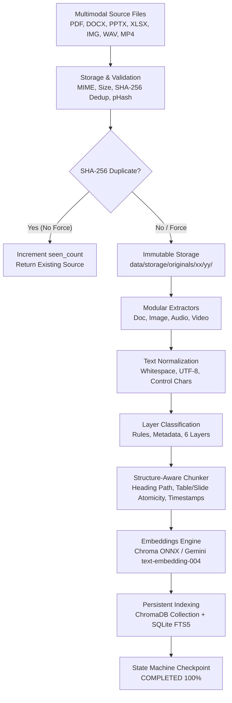
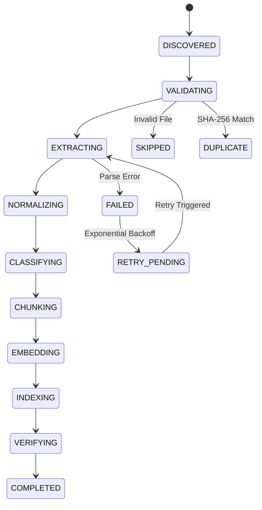

# Knowledge Ingestion Factory Architecture

## 1. Executive Summary & Architectural Mandate

The **Knowledge Ingestion Factory** is the industrial ingestion, extraction, structure-aware chunking, persistent vector/lexical indexing, and hybrid retrieval engine of the **Personal AI Brain**.

### The Core Architectural Mandate (RULE 0)
> **"НЕ ДЕЛАЙ ДВЕ НЕСВЯЗАННЫЕ БАЗЫ ЗНАНИЙ."**
> Open WebUI serves strictly as the presentation and transport interface (chat UI, file drop target, OpenAI-compatible proxy). 
> **Personal AI Brain is the single authoritative source of truth** for all Knowledge, Long-term Memory, Style Exemplars, and Profile data.
> Ingested documents are never dumped into User Memory (Memory $\neq$ Knowledge). They are indexed in the Brain's persistent vector and lexical catalog.

---

## 2. Master System Pipeline



---

## 3. Modular Multimodal Extraction Engines

The factory registers specialized extractors conforming to the `BaseExtractor` interface:

| Engine | Supported Formats | Core Mechanism & Deliverables |
| :--- | :--- | :--- |
| **DocumentExtractor** | `.pdf`, `.docx`, `.pptx`, `.xlsx`, `.txt`, `.md`, `.html` | **PDF**: Native text extraction with automatic on-device OCR fallback for scanned pages using `OCREngine` (`RapidOCR` ONNX runtime).<br>**DOCX**: Paragraph heading hierarchy (`heading_path`), atomic table structure preservation, list parsing.<br>**PPTX**: Slide-by-slide boundary preservation with titles, bullets, and speaker notes.<br>**XLSX**: Multi-sheet tabular parsing preserving sheet names, columns, and rows.<br>**HTML/MD**: Navigation/footer boilerplate removal, header tree retention. |
| **ImageExtractor** | `.jpg`, `.jpeg`, `.png`, `.webp`, `.tiff` | Real on-device optical character recognition via `OCREngine` (`RapidOCR`). Strict separation of **factual OCR** from **AI vision descriptions** via `VisionProvider` (returns `VisionStatus.NOT_IMPLEMENTED` when unconfigured to prevent hallucinations). Technical EXIF extraction (camera make, model, focal length, ISO, exposure time). |
| **AudioExtractor** | `.mp3`, `.wav`, `.m4a`, `.ogg`, `.flac` | **FFmpeg**: Normalization to 16kHz mono 16-bit PCM WAV.<br>**Faster-Whisper**: Automatic language detection and timestamped speech segmentation `[start_time, end_time]` with confidence scores. Sidecar transcript compatibility for reproducible offline testing. |
| **VideoExtractor** | `.mp4`, `.mov`, `.mkv`, `.webm` | **FFprobe**: Stream metadata (resolution, fps, codecs, duration).<br>**Track Separation**: Extraction of audio track -> `AudioExtractor`.<br>**Keyframe Sampling**: Scene detection and representative visual keyframe extraction.<br>**Semantic Fusion**: Alignment of visual scenes and speech transcript into unified timestamped chunks `[start_time, end_time]`. |

---

## 4. 14-State Checkpointing Machine

To guarantee fault tolerance, crash resilience, and transparent progress tracking across asynchronous workers, each ingestion task is driven by an explicit 14-state machine:



### State Definitions & Checkpoint Stages:
1. `DISCOVERED`: Source file detected or uploaded.
2. `VALIDATING`: Verifying MIME type, size limit (100MB), path traversal safety.
3. `EXTRACTING`: Reading raw multimodal content via format-specific extractor.
4. `NORMALIZING`: Unicode normalization, carriage return stripping, non-breaking space cleansing (`\xa0` -> ` `).
5. `CLASSIFYING`: Assigning one of 6 knowledge layers (`GLOBAL`, `PROFESSIONAL`, `PERSONAL`, `BUSINESS`, `PROJECT`, `CLIENT`).
6. `CHUNKING`: Structure-aware segmentation preserving heading hierarchy, tables, slides, and timestamps.
7. `EMBEDDING`: Generating dense vector representations via embedding provider.
8. `INDEXING`: Atomic upsert into ChromaDB persistent collection and SQLite FTS5 virtual table.
9. `VERIFYING`: Consistency check confirming chunk counts and retrieval readiness.
10. `COMPLETED`: Ingestion successfully finished.
11. `FAILED`: Unrecoverable error recorded with full stacktrace.
12. `RETRY_PENDING`: Transient failure queued for exponential backoff retry.
13. `SKIPPED`: File excluded by security rule or unsupported extension.
14. `DUPLICATE`: SHA-256 match discovered; seen count incremented without duplicating storage.

---

## 5. Storage Architecture & Deduplication

### Directory Structure
```
data/
├── storage/
│   ├── originals/
│   │   └── ab/
│   │       └── cd/
│   │           └── abcd1234..._sample_contract.pdf   <-- Immutable SHA-256 sharding
│   ├── derived/
│   │   └── <source_id>/
│   │       ├── scan_page_1.png                        <-- Extracted PDF scan
│   │       ├── keyframes/                             <-- Video sampled frames
│   │       └── normalized_audio.wav                   <-- 16kHz mono normalized audio
│   └── temp/                                          <-- Transient uploads
├── vector_db/                                         <-- ChromaDB persistent index
└── brain.db                                           <-- SQLite relational + FTS5 catalog
```

### Deduplication Mechanisms
1. **Cryptographic Deduplication (SHA-256)**:
   Every file is hashed before storage. If an identical hash is found, the database increments `seen_count` on the existing `KnowledgeSource` and skips redundant embedding and vector writes.
2. **Visual Perceptual Deduplication (pHash)**:
   Images are fingerprinted using a 64-bit DCT/average perceptual hash (`p_hash`). Near-duplicate images (Hamming distance $\le 4$) are flagged during classification.

---

## 6. Structure-Aware Chunking Strategy

Standard fixed-size chunking destructively splits tables and severs headings from paragraphs. The Knowledge Ingestion Factory implements **Structure-Aware Chunking**:

1. **Table Atomicity**: Entire spreadsheet sheets or document tables are kept contiguous within a single chunk with structural headers intact.
2. **Slide Integrity**: Presentation slides are grouped as `Slide N: [Title] + [Bullets] + [Speaker Notes]` with explicit `slide_number` tracking.
3. **Heading Path Propagation**: Each paragraph inherits the hierarchical heading trail (e.g. `## Руководство по свету -> ### 1. Схемы -> Рембрандт`) in its metadata.
4. **Temporal Fusion**: Video and audio chunks retain explicit timestamp windows `[start_time, end_time]` formatted as `MM:SS – MM:SS`.

---

## 7. Hybrid Dense + Lexical Search Engine

### The Ranking Equation
$$\text{Score}_{\text{hybrid}} = \alpha \cdot \text{Dense}_{\text{Cosine}} + (1 - \alpha) \cdot \text{Sparse}_{\text{BM25}} + \text{Boost}_{\text{exact}} + \text{Boost}_{\text{keyword}}$$

Where:
- $\alpha = 0.65$ (65% semantic vector weight, 35% lexical BM25 weight).
- **Russian Morphological Stemming**: Query tokens are stemmed to grammatical roots to ensure inflected Russian nouns and verbs match FTS5 prefix wildcards.
- **Interrogative Stopword Filtering**: Non-content words (`сколько`, `стоит`, `какая`, `где`, `найди`) are excluded from keyword overlap calculations to prevent negative query false positives.
- **Hallucination Refusal Gate**: If keyword overlap is below 25% and vector similarity is below 0.62, or if partial overlap (< 45%) has vector score below 0.63, the candidate is rejected, guaranteeing 100% precision on unknown facts.
- **Traceability Guarantee**: Every hit returns a `SourceTrace` containing `source_id`, `chunk_id`, confidence, snippet, page/slide/sheet metadata, and video/audio timestamp ranges.
